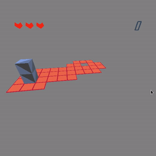
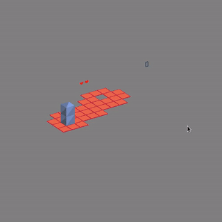

Graphics Assignment 2
=====================

3D block game in OpenGL 3. More details in [the statement pdf](Assignment2.pdf)

Features at a glance
--------------------

| Features | Demos |
|----------|-------|
| World orbitting, Normal movement, Animation and Game Logic |        |
| Isometric style view usign an orthographic camera          |  |
| Other views - First-person view, third person view, top view, top orthographic view |  |
| Helicopter view - More intuitive blender-like perspective view with camera panning & movement |  |

Megh Parikh - 201501184
=======================

Controls
--------

- Arrow keys - Move block
- c - toggle between perspective and ortho view
- v - toggle between different views (tower view, block view, follow view, top view, helicopter view)
- tower view
  - space - revolve camera
  - z/x - change camera y coordinate
- mouse scroll - zoom
- helicopter view
  - mouse click and drag - move camera
  - mouse scroll - move camera near/far

Extra features
--------------

- Background music
- 3 Lifes
- Score and Life counter
- Switches (2 types) and bridges
- Fragile tiles (green)
- Teleport tiles (black)
- Detailed blender models
- Animations
  - Tumbling/Falling out of board animation
  - Falling through goal animation
  - Game over animation
- Tiles with edges
- Level editor and blender obj file parser
- Modular codebase

License
-------
The MIT License https://meghprkh.mit-license.org/

Copyright &copy; 2017 Megh Parikh <meghprkh@gmail.com>

Music Credits: Eric Matyas (http://www.soundimage.org)
